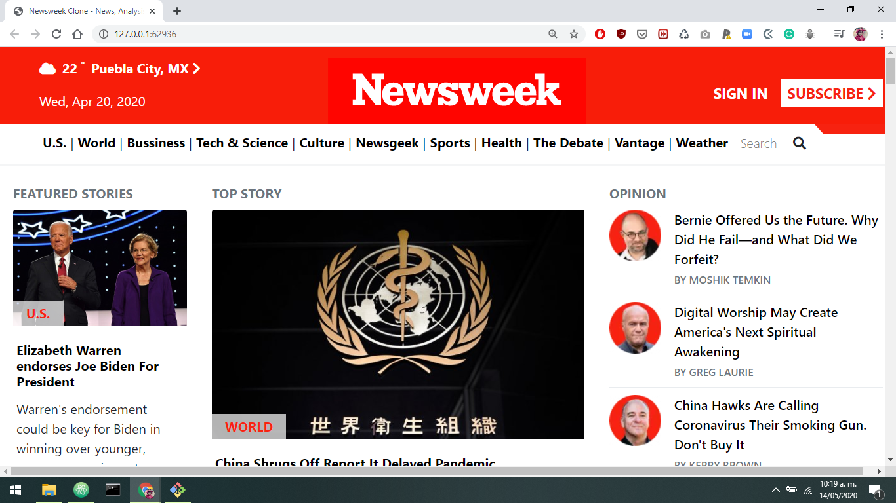
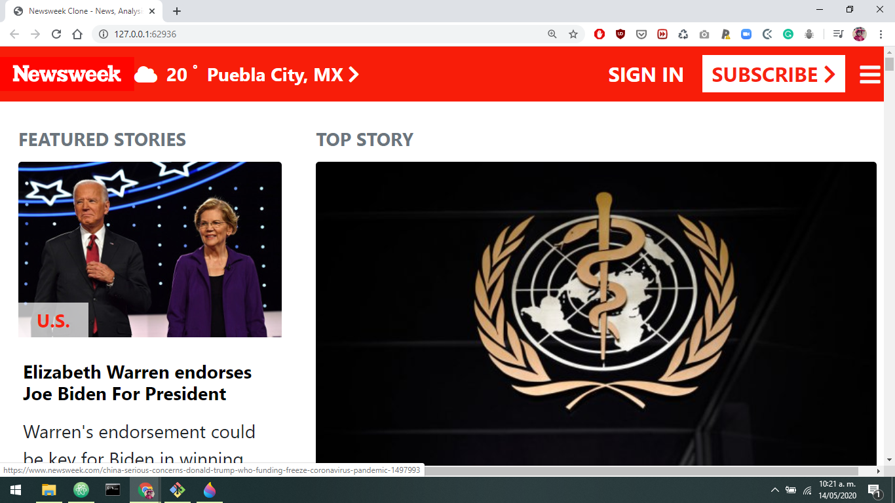
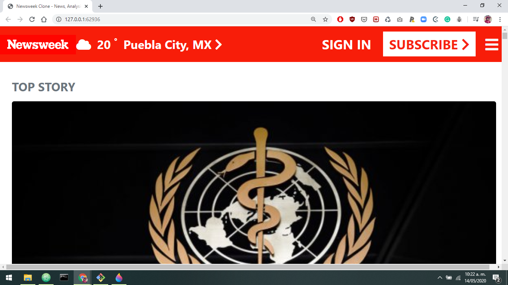

# 7th Microverse Project: Using Bootstrap

> This project requests students to build a replica of the news site Newsweek.com using the Bootstrap framework. The goal of the project was to learn responsive developing layouts using bootstrap framework and css properties to get the design. 

The project has a responsive view in small, medium and large devices.

Original site looks like this:
[Live Demo Link](https://newsweek.com)

Large Devices

Medium Devices

Small Devices

## Built With

- Html,
- CSS,
- Bootstrap

## Live Demo

You can see the project in action:
[Live Demo Link](https://rawcdn.githack.com/duducus/Responsive-Design-and-CSS-Frameworks---Part-2/b22e032947ef2c10ee02c32aa10e3137a229abea/index.html)

## Author

👤 **Jorge Cerón**

- Github: [@duducus](https://github.com/duducus)
- Twitter: [@jorgecerong](https://twitter.com/jorgecerong)
- Linkedin: [Jorge Cerón Gil](https://linkedin.com/linkedinhandle)

## Show your support

Give a ⭐️ if you like this project!

## 📝 License

This project is [MIT](lic.url) licensed.
